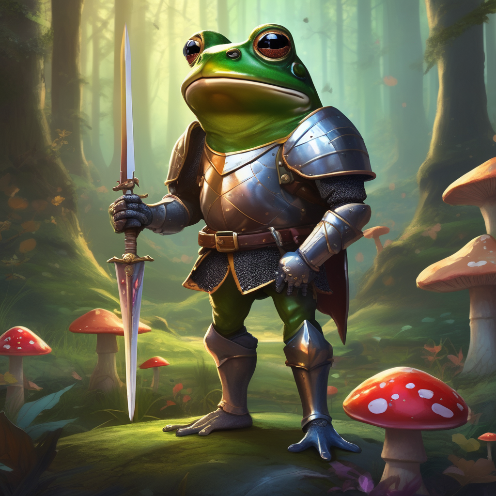

# Prompt Upsampling for Diffusion Models

<a href="https://colab.research.google.com/github/soumik12345/diffusion_prompt_upsampling/blob/main/generate_and_validate.ipynb" target="_parent"></a>

Prompting for current generation of text-to-image diffusion models is extremely brittle (such as [Stable Diffusion XL](https://huggingface.co/papers/2307.01952)), i.e, its difficult to create an optimal prompting strategy to reliably generate images of a certain quality and sometimes even reliably following the prompt to generate the image.

This project aims to implement the prompt upsampling strategy as mentioned in the technical report from OpenAI accompanying DALL-E 3; [Improving Image Generation with Better Captions](https://cdn.openai.com/papers/dall-e-3.pdf). This prompting strategy helps us improve the quality of generated images even while using baseline prompts.

The repository using [DSPy](https://dspy-docs.vercel.app) + [GPT-4o](https://platform.openai.com/docs/models/gpt-4o) for prompt upsampling and [Weave](https://wandb.me/weave) to trace and evaluate the workflow.

Check out [github.com/sayakpaul/caption-upsampling](https://github.com/sayakpaul/caption-upsampling) for another implementation of the same idea.

## Sample Results

| Base prompt | Image generated with pase prompt | Image generated with upsampled prompt |
| --- | --- | --- |
| A frog dressed as a knight |  |  |
| A bird scaring a scarecrow |  |  |
| Photo of a serene park setting |  |  |
| cartoon drawing of an astronaut riding a horse in outer space |  |  |

|  | 
| --- |
| A sample trace showing a [prompt upsampling workflow on Weave](https://wandb.ai/geekyrakshit/diffusion-prompt-upsample/weave/calls?filter=%7B%22opVersionRefs%22%3A%5B%22weave%3A%2F%2F%2Fgeekyrakshit%2Fdiffusion-prompt-upsample%2Fop%2FStableDiffusionXLModel.predict%3A*%22%5D%7D&peekPath=%2Fgeekyrakshit%2Fdiffusion-prompt-upsample%2Fcalls%2F8addeba5-5956-4acb-8951-d0ff1c8133e7) |

|  |
| --- |
| A sample trace showing an [evaluation workflow using an LLM judge on Weave](https://wandb.ai/geekyrakshit/diffusion-prompt-upsample/weave/calls?filter=%7B%22opVersionRefs%22%3A%5B%22weave%3A%2F%2F%2Fgeekyrakshit%2Fdiffusion-prompt-upsample%2Fop%2FOpenAIJudgeModel.predict%3A*%22%5D%7D&peekPath=%2Fgeekyrakshit%2Fdiffusion-prompt-upsample%2Fcalls%2F0d118404-9d28-4b91-97c8-b92ca2b1d323) |

## Installation and Usage Instructions

First, you need to follow the instructions at [pytorch.org](https://pytorch.org/) to install pytorch. Then you need to clone the repositories and install the dependencies:

```shell
git clone https://github.com/soumik12345/diffusion_prompt_upsampling
cd diffusion_prompt_upsampling
pip install -qe .
```

Note that the prompt upsampling feature is dependent on GPT-4o and the evaluation model uses an OpenAI multi-modal LLM. Hence, you will need to provide an OpenAI API Key.

```shell
export OPENAI_API_KEY="<YOUR-OPENAI-API-KEY>"
```

Next, you can run the following script:

<details>
    <summary><code>python scripts/generate_and_validate.py</code></summary>


```
NAME
    generate_and_validate.py

SYNOPSIS
    generate_and_validate.py BASE_PROMPT <flags>

POSITIONAL ARGUMENTS
    BASE_PROMPT
        Type: str

FLAGS
    -p, --project_name=PROJECT_NAME
        Type: Optional
        Default: 'diffusion-prompt-upsample'
    -e, --entity_name=ENTITY_NAME
        Type: Optional[Optional]
        Default: None
    --diffusion_model_name_or_path=DIFFUSION_MODEL_NAME_OR_PATH
        Type: Optional
        Default: 'stabilit...
    --diffusion_model_enable_cpu_offfload=DIFFUSION_MODEL_ENABLE_CPU_OFFFLOAD
        Type: Optional
        Default: True
    --upsample_prompt=UPSAMPLE_PROMPT
        Type: Optional
        Default: False
    --use_stock_negative_prompt=USE_STOCK_NEGATIVE_PROMPT
        Type: Optional
        Default: False
    -o, --openai_model=OPENAI_MODEL
        Type: Optional
        Default: 'gpt-4-turbo'
    -j, --judge_model_seed=JUDGE_MODEL_SEED
        Type: Optional
        Default: 42

NOTES
    You can also use flags syntax for POSITIONAL ARGUMENTS
```
</details>
